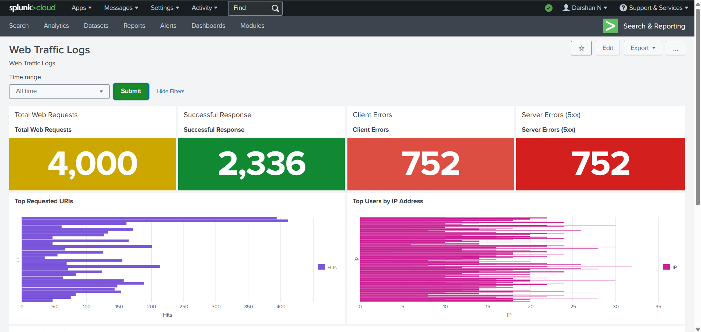
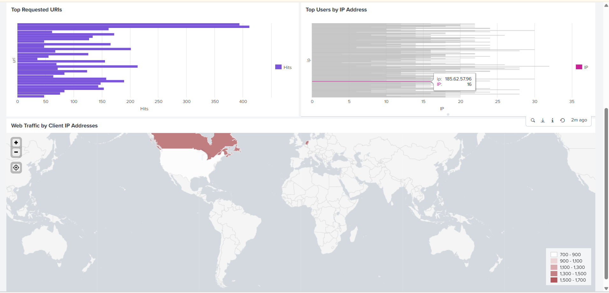

# 🔍 Web Traffic Log Analysis using Splunk

## 📌 Overview
This project demonstrates the analysis of web traffic logs using Splunk to extract meaningful insights, identify usage patterns, and detect potential anomalies. The focus is on applying SPL (Search Processing Language) to transform raw log data into actionable information.

---

## 🎯 Objectives
- Analyze web traffic logs to understand request patterns  
- Identify high-frequency IP addresses and accessed resources  
- Examine HTTP status codes for anomalies  
- Visualize traffic trends over time  
- Gain hands-on experience with Splunk as a SIEM tool  

---

## 🛠 Tools & Technologies
- Splunk Cloud  
- SPL (Search Processing Language)  
- Web server log dataset  

---

## 📂 Dataset
- Type: Web traffic logs  
- Format: `.log`  
- Description: Contains records of HTTP requests including IP address, timestamp, requested resource, and status codes  

---

## 🔎 SPL Queries & Analysis

### 1. Total Number of Requests
```spl
index=* | stats count
```

### 2. Top Requested Resources
```spl
index=* | stats count by url | sort - count
```

### 3. Traffic by Source IP
```spl
index=* | stats count by src_ip | sort - count
```

### 4. HTTP Status Code Distribution
```spl
index=* | stats count by status
```

### 5. Traffic Trend Over Time
```spl
index=* | timechart count
```

---

## 📊 Key Observations
- A small number of IP addresses generated a large portion of traffic  
- Certain URLs were accessed significantly more than others  
- Presence of repeated 404 errors indicates possible scanning activity  
- Noticeable spikes in traffic suggest irregular or burst activity  

---

## 🚨 Security Insights
- High-frequency requests from a single IP may indicate automated scripts or bots  
- Repeated error responses (e.g., 404) can suggest reconnaissance attempts  
- Traffic spikes could be linked to abnormal or suspicious behavior  

---

## 🔥 Detection Example
```spl
index=* 
| stats count by src_ip 
| where count > 100
```
This query helps identify IP addresses generating unusually high traffic, which may indicate bot activity or scanning attempts.

---

## 📸 Screenshots

### Dashboard View



---

## 📁 Project Structure
```
web-traffic-analysis/
│
├── README.md
├── logs/
│   └── web_logs.log
├── screenshots/
│   ├── dashboard1.png
│   ├── dashboard2.png
└── queries/
    └── spl_queries.txt
```

---

## 🧠 Learning Outcomes
- Developed practical experience in log analysis using Splunk  
- Gained understanding of SPL for querying and transforming data  
- Learned to identify patterns and anomalies in web traffic  
- Built basic dashboards for visualization  

---

## 📌 Conclusion
This project demonstrates how raw web logs can be transformed into meaningful insights using Splunk. It highlights the importance of log analysis in monitoring systems, detecting anomalies, and supporting security operations.
